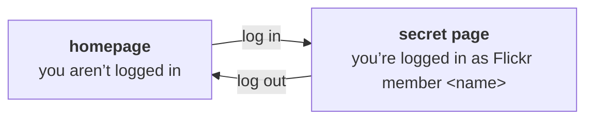

# flickr-flask-login-demo

This is a demo app that allows users to log in to your Flask app using Flickr and OAuth.

It implements a very basic flow:



**This code is for teaching purposes only.**
You should read it, understand it, and copy it to add Flickr login to your own Flask apps.
It includes extensive comments and tests.
It is **not** production-ready -- for example, it doesn't [secure its cookies](https://blog.miguelgrinberg.com/post/cookie-security-for-flask-applications), and it uses a hard-coded [secret key](https://flask.palletsprojects.com/en/stable/config/#SECRET_KEY).

## Recommended reading

To understand this code, it would be helpful to read the following:

*   Flickr's docs about [using OAuth with Flickr](https://www.flickr.com/services/api/auth.oauth.html)
*   Miguel Grinberg's article about [OAuth authentication with Flask](https://blog.miguelgrinberg.com/post/oauth-authentication-with-flask-in-2023) (2023)
*   Miguel Grinberg's Flask Mega-Tutorial, in particular the section on [User Logins with Flask-Login](https://blog.miguelgrinberg.com/post/the-flask-mega-tutorial-part-v-user-logins) (2024)

## Running the app locally

1.  Clone this repository:

    ```console
    $ git clone https://github.com/Flickr-Foundation/flickr-flask-login-demo.git
    $ cd flickr-flask-login-demo
    ```

2.  Create a virtual environment and install dependencies:

    ```console
    $ python3 -m venv .venv
    $ source .venv/bin/activate
    $ python3 -m pip install -r requirements.txt
    ```

3.  Create a Flickr app by visiting <https://www.flickr.com/services/apps/create/>

    This will give you a client ID and client secret:

    

    You need to save these two values to your login keychain using the `keyring` command:

    ```console
    $ keyring set flickr_flask_login_demo key
    $ keyring set flickr_flask_login_demo secret
    ```

4.  Start the Flask app by running:

    ```console
    $ flask run --debug --port 8008
    ```

    You can now see the running app at <http://127.0.0.1:8008/>.
