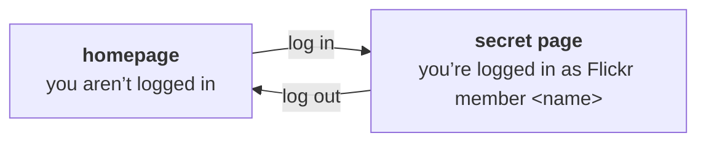

# flickr-flask-login-demo

This is a demo app that allows users to log in to your Flask app using Flickr and OAuth.

It implements a very basic flow:



This repo is a demo for teaching purposes, so you can add Flickr login to your own Flask apps.
It includes extensive comments and tests.

## Recommended reading


---

# Development

You can set up a local development environment by cloning the repo and installing dependencies:

```
$ git clone https://github.com/Flickr-Foundation/flickr-flask-auth.git
$ cd flickr-flask-auth
$ python3 -m venv .venv
$ source .venv/bin/activate
$ pip install -e .
```

You'll need to create a Flickr API key to get a client_id and client_secret, at this URL:

https://www.flickr.com/services/apps/create/


Once you have those you'll use `keyring` to set them, like so.

```
keyring set flickr_flask_auth key
keyring set flickr_flask_auth secret
```

You can get a local development server with this command:

```
$ python3 -m flask run --debug [--port=nnnn]
```
